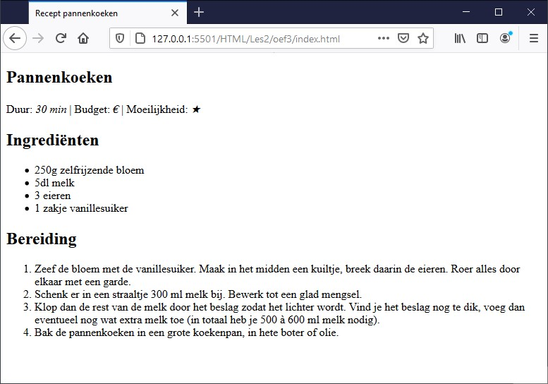

# Oefening
Zoek een recept en toon dit aan de hand van lijsten. Toon de benodigde ingrediënten in een ongesorteerde lijst. Stappen die je moet uitvoeren staan best in een gesorteerde lijst.

Tip vergeet andere semantische tags niet.

Zorg voor een css class currentstep waarbij je de huidige stap aanduid met een ander symbool.

## Voorbeeld

