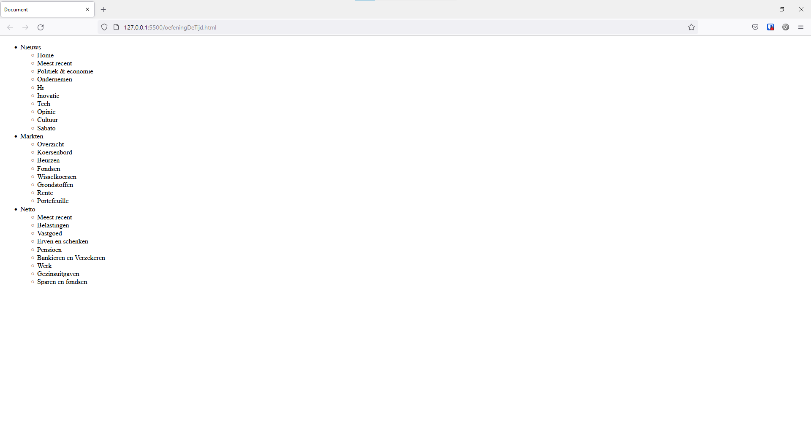
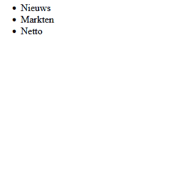
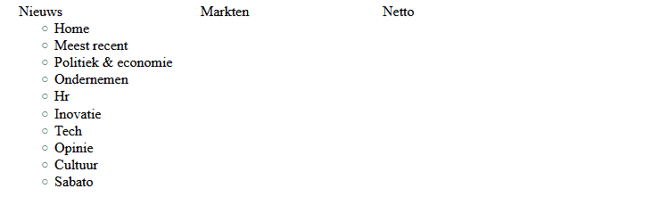

# Oefening
Maak een menu gebaseerd op het menu van "de tijd". Voorzie dus een hoofdmenu met een submenu.

Als je klaar bent met alle oefeningen kan je eens proberen enkel het sub menu te tonen bij hoveren.

Indien je wil kan je ook nog een uitbreiding maken waarbij het submenu van nieuws altijd zichtbaar is, wanneer er over niets gehoverd wordt.

